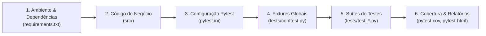

# 🏗️ Guia de Criação Passo a Passo: Construindo o Projeto do Zero

Este documento apresenta o processo completo e estruturado de como este repositório foi concebido, desde a modelagem do código de produção até a suíte de testes com **Pytest** e seus principais plugins.

---

## 🧭 Visão Geral do Fluxo de Desenvolvimento



---

## 🛠️ Passo 1: Definir o Ambiente e as Dependências

Antes de escrever o código de produção, estabelecemos a estrutura de pastas e definimos as ferramentas necessárias.

### 1.1. Estrutura Inicial de Diretórios
```bash
mkdir -p Seminario/src/ecommerce Seminario/src/utils Seminario/tests Seminario/reports
```

### 1.2. Definição do [`requirements.txt`](file:///home/mateuszaparoli/ufmg/8_semestre/Teste%20de%20Software/Seminario/requirements.txt)
Listamos o Pytest e os 6 plugins essenciais para o seminário:

```text
pytest>=8.0.0
pytest-cov>=5.0.0       # Medição de cobertura de código
pytest-mock>=3.14.0     # Fixture mocker para dublês de teste (mocks/spies)
pytest-xdist>=3.5.0     # Execução paralela em múltiplos núcleos de CPU
pytest-sugar>=1.0.0     # Visualização moderna com barra de progresso no terminal
pytest-html>=4.1.1      # Geração de relatórios standalone em HTML
pytest-asyncio>=0.23.0  # Suporte nativo a testes assíncronos (async/await)
```

---

## 📦 Passo 2: Construir o Código de Produção (`Seminario/src/`)

O código de negócio foi projetado em **camadas de complexidade incremental**, criando cenários ideais para exercitar diferentes técnicas de teste:

```text
src/
├── __init__.py
├── utils/
│   ├── __init__.py
│   └── validators.py          # 1. Funções Puras (Sem estado / efeitos colaterais)
└── ecommerce/
    ├── __init__.py
    ├── models.py              # 2. Entidades de Domínio e Regras de Negócio
    ├── payment_service.py     # 3. Gateway Externo Síncrono (Simulado)
    ├── notification_service.py# 4. Comunicação Externa e Assíncrona
    └── checkout.py            # 5. Orquestrador de Alto Nível
```

### 2.1. Funções Puras em [`src/utils/validators.py`](file:///home/mateuszaparoli/ufmg/8_semestre/Teste%20de%20Software/Seminario/src/utils/validators.py)
- **Objetivo:** Validações de CPF (algoritmo da Receita Federal), formato de e-mail e cálculo de descontos por cupom (`DESC10`, `DESC20`, `FRETEGRATIS`, `VIP50`).
- **Por que criamos assim:** Funções puras (entrada $\rightarrow$ saída determinística) são o caso perfeito para demonstrar **testes parametrizados** e **asserções simples**.

### 2.2. Modelos de Domínio em [`src/ecommerce/models.py`](file:///home/mateuszaparoli/ufmg/8_semestre/Teste%20de%20Software/Seminario/src/ecommerce/models.py)
- **Objetivo:** Classes `@dataclass` como `Item`, `Cliente` e `CarrinhoDeCompras`.
- **Regras:** Validações no `__post_init__` (preço negativo ou quantidade zero disparam `ValueError`), métodos para adicionar/remover itens e cálculo dinâmico de subtotal, descontos (incluindo bônus VIP de +5%) e total.
- **Por que criamos assim:** Permite validar regras de negócio ricas e testar exceções com `pytest.raises`.

### 2.3. Serviços Externos em [`src/ecommerce/payment_service.py`](file:///home/mateuszaparoli/ufmg/8_semestre/Teste%20de%20Software/Seminario/src/ecommerce/payment_service.py) e [`src/ecommerce/notification_service.py`](file:///home/mateuszaparoli/ufmg/8_semestre/Teste%20de%20Software/Seminario/src/ecommerce/notification_service.py)
- **Objetivo:** Simulação de chamadas a adquirentes de cartão (sucesso, `CartaoRecusadoException`, `GatewayTimeoutException`) e envio de e-mails/SMS/Push notifications assíncronas.
- **Por que criamos assim:** Cria a necessidade real de isolar chamadas de rede através de **Mocks**, **Spies** e testes de **corrotinas assíncronas**.

### 2.4. Orquestrador em [`src/ecommerce/checkout.py`](file:///home/mateuszaparoli/ufmg/8_semestre/Teste%20de%20Software/Seminario/src/ecommerce/checkout.py)
- **Objetivo:** A classe `ProcessadorCheckout` junta tudo: valida o carrinho, aciona o gateway e despacha a notificação se aprovado, gerando um `ReciboCheckout`.

---

## ⚙️ Passo 3: Configurar o Pytest ([`Seminario/pytest.ini`](file:///home/mateuszaparoli/ufmg/8_semestre/Teste%20de%20Software/Seminario/pytest.ini))

O arquivo de configuração centraliza o comportamento do test runner:

```ini
[pytest]
minversion = 8.0
testpaths = tests
python_files = test_*.py
python_classes = Test*
python_functions = test_*
addopts = 
    -ra
    --strict-markers
    --strict-config

markers =
    slow: Marca testes lentos (ex: simulação de IO, integração pesada) para filtragem e paralelização
    unit: Marca testes unitários rápidos e isolados
    integration: Marca testes de integração entre múltiplos componentes
    asyncio: Marca testes assíncronos (pytest-asyncio)
```

---

## 🧩 Passo 4: Criar as Fixtures Globais ([`Seminario/tests/conftest.py`](file:///home/mateuszaparoli/ufmg/8_semestre/Teste%20de%20Software/Seminario/tests/conftest.py))

O `conftest.py` é o coração da modularização de testes no Pytest. Ele provê **Injeção de Dependência** automática:

1. **`sessao_de_testes_info`:** Fixture `scope="session"` com `autouse=True` para logs de início e fim da suíte.
2. **`cliente_valido` e `cliente_vip`:** Modelos prontos para consumo nos testes.
3. **`itens_padrao`:** Coleção de 3 produtos para montagem de carrinhos.
4. **`carrinho_com_produtos`:** **Composição de fixtures** — consome `cliente_valido` e `itens_padrao` e entrega um carrinho populado (subtotal R$ 730,00).
5. **`recurso_temporario_com_teardown`:** Demonstração do ciclo de vida com `yield` (código antes do `yield` = setup; código após o `yield` = teardown garantido).

---

## 🧪 Passo 5: Construir as Suítes de Testes Módulo a Módulo

Organizamos a pasta `tests/` com arquivos especializados:

```text
tests/
├── conftest.py                # Fixtures e ciclo de vida
├── test_validators.py         # 1. Asserções nativas + @pytest.mark.parametrize
├── test_models.py             # 2. Fixtures + Regras de negócio + pytest.raises
├── test_checkout.py           # 3. pytest-mock (mocker.patch e mocker.spy)
├── test_performance_slow.py   # 4. pytest-xdist (-n auto) + @pytest.mark.slow
└── test_async_service.py      # 5. pytest-asyncio (@pytest.mark.asyncio)
```

### 5.1. [`test_validators.py`](file:///home/mateuszaparoli/ufmg/8_semestre/Teste%20de%20Software/Seminario/tests/test_validators.py) — Asserções e Parametrização
- **Asserção Nativa:** Uso do `assert` simples com reescrita de AST (*AST rewriting*).
- **Parametrização:**
  ```python
  @pytest.mark.parametrize(
      "cpf, esperado",
      [
          ("111.444.777-35", True),
          ("111.111.111-11", False),
          (None, False),
      ],
      ids=["cpf_valido", "cpf_digitos_repetidos", "cpf_nulo"]
  )
  def test_validacao_cpf(self, cpf, esperado):
      assert validar_cpf(cpf) == esperado
  ```
- **Testes de Exceção:** `with pytest.raises(ValueError, match="..."):` para validar mensagens de erro de cupons inválidos.

### 5.2. [`test_models.py`](file:///home/mateuszaparoli/ufmg/8_semestre/Teste%20de%20Software/Seminario/tests/test_models.py) — Fixtures e Regras de Negócio
- Injeção direta de `carrinho_com_produtos` e `carrinho_vip_com_produtos`.
- Teste de mutações de estado: adição de item duplicado incrementando quantidade, remoção de itens e descontos cumulativos para VIPs.

### 5.3. [`test_checkout.py`](file:///home/mateuszaparoli/ufmg/8_semestre/Teste%20de%20Software/Seminario/tests/test_checkout.py) — Dublês de Teste com `pytest-mock`
- **Mock (`mocker.patch.object`):** Simula resposta do gateway sem bater em rede externa:
  ```python
  mock_processar = mocker.patch.object(
      gateway, "processar_cobranca",
      return_value=RespostaPagamento(sucesso=True, transacao_id="TX_123", ...)
  )
  ```
- **Spy (`mocker.spy`):** Monitora chamadas reais:
  ```python
  spy_email = mocker.spy(notificador, "enviar_email_confirmacao")
  # Asserção de que o email foi disparado apenas se a compra for aprovada
  assert spy_email.call_count == 1
  ```
- **Simulação de Erros:** `side_effect=CartaoRecusadoException` garantindo que o e-mail **não** seja enviado em caso de recusa (`spy_email.assert_not_called()`).

### 5.4. [`test_performance_slow.py`](file:///home/mateuszaparoli/ufmg/8_semestre/Teste%20de%20Software/Seminario/tests/test_performance_slow.py) — Paralelização com `pytest-xdist`
- 6 testes simulando latência de I/O (`time.sleep(0.4)` cada).
- Marcados com `@pytest.mark.slow`.
- Demonstra a diferença entre execução sequencial (~2.4s) e paralela com `pytest -n auto` (~0.5s).

### 5.5. [`test_async_service.py`](file:///home/mateuszaparoli/ufmg/8_semestre/Teste%20de%20Software/Seminario/tests/test_async_service.py) — Testes Assíncronos com `pytest-asyncio`
- Funções assíncronas decoradas com `@pytest.mark.asyncio`:
  ```python
  @pytest.mark.asyncio
  async def test_enviar_push_async(self):
      notificador = ServicoNotificacao()
      res = await notificador.enviar_notificacao_push_async("USR-1", "Titulo", "Corpo")
      assert res["status"] == "delivered"
  ```

---

## 📊 Passo 6: Auditoria, Cobertura e Relatórios

Com os testes prontos, configuramos a geração de métricas:

1. **Cobertura Completa (`pytest-cov`):**
   ```bash
   pytest --cov=src --cov-report=term-missing --cov-report=html
   ```
2. **Relatório HTML Standalone (`pytest-html`):**
   ```bash
   pytest --html=reports/report.html --self-contained-html
   ```
3. **Demonstração Interativa (`demo_script.sh`):**
   Script bash para guiar a apresentação ao vivo com pausas pedagógicas e explicações em cada etapa.

---

## 📋 Checklist Resumo para Novos Projetos

| Etapa | Ação Prática | Arquivos Criados |
| :--- | :--- | :--- |
| **1. Setup** | Criar pastas e definir dependências | `requirements.txt` |
| **2. Domínio** | Implementar lógica de negócio limpa | `src/utils/`, `src/ecommerce/` |
| **3. Configuração** | Definir regras do test runner e markers | `pytest.ini` |
| **4. Fixtures** | Centralizar massa de teste e injeção de dependência | `tests/conftest.py` |
| **5. Testes** | Criar testes organizados por responsabilidade | `tests/test_*.py` |
| **6. Qualidade** | Medir cobertura e gerar relatórios visuais | `pytest-cov`, `pytest-html` |
